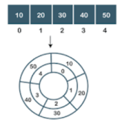

# Queue

## Theory
Queue is a linear data structure in which elements can be inserted only from one side of the list called rear, and the elements can be deleted only from the other side called the front. The queue data structure follows the FIFO (First In First Out) principle, i.e. the element inserted at first in the list, is the first element to be removed from the list. The insertion of an element in a queue is called an enqueue operation and the deletion of an element is called a dequeue operation. Circular Queue is another type of queue data structure which is essentially a variation of the linear queue in which front and rear-end are connected to each other to optimize the space wastage of the Linear queue and make it efficient.
 
The diagrammatic representation of the Linear queue is given below:
 

 
The diagrammartic representaion of circular queue is fiven below:
 
 

 
## Output
